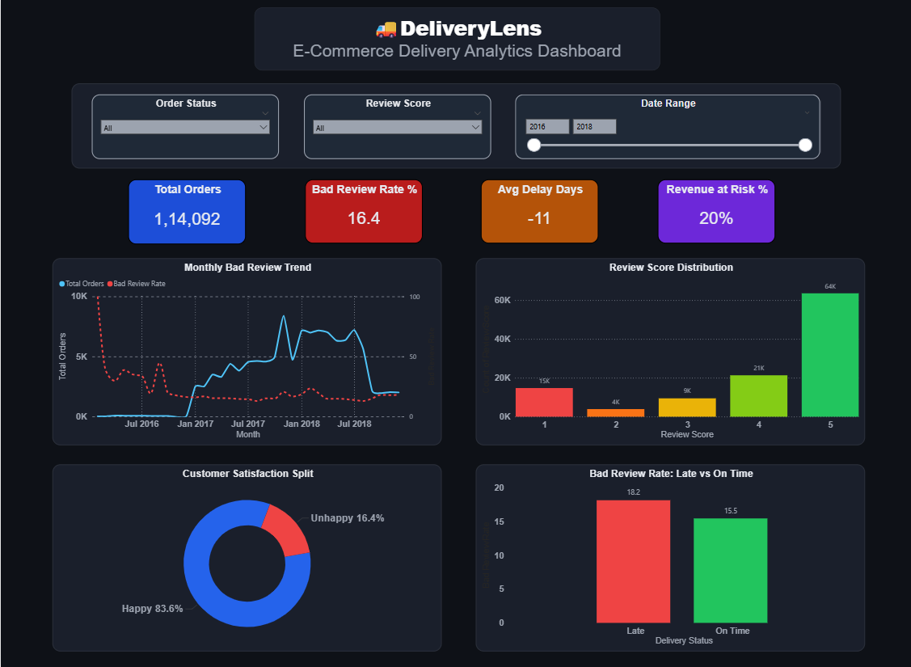

# DeliveryLens
### E-Commerce Delivery & Customer Satisfaction Analysis


---

## Problem Statement

E-commerce companies often lose customers not because of bad products, but because of poor delivery experience. This project analyzes 1,14,092 real orders from Olist (Brazilian e-commerce platform) to understand the relationship between delivery performance and customer satisfaction.

---

## Dashboard Preview



---

## Key Findings

- 16.4% of customers gave bad reviews (1–2 stars) — 1 in every 6 customers was unhappy
- Late orders had 18.2% bad review rate vs 15.5% for on-time orders
- Orders peaked in November 2017 — bad reviews followed the same growth pattern
- 20% of total revenue is associated with dissatisfied customers

---

## Project Structure
```
deliverylens-ecommerce-analysis/
│
├── data/                  # Raw and cleaned CSV files
├── notebooks/             # Jupyter notebooks (EDA, cleaning)
├── sql/                   # MySQL queries
├── images/                # Power BI screenshot
└── problem_statement.md   # Detailed problem statement
```

---

## Tools Used

| Tool | Purpose |
|------|---------|
| Python | Data cleaning, EDA |
| Pandas & Seaborn | Analysis & visualization |
| MySQL | SQL queries & business analysis |
| Power BI | Interactive dashboard |

---

## Dataset

Olist Brazilian E-Commerce Dataset — [Kaggle](https://www.kaggle.com/datasets/olistbr/brazilian-ecommerce)

---

## Connect

**LinkedIn:** linkedin.com/in/aditya-sharma-9b6588286
**GitHub:** github.com/aditya-datahub
